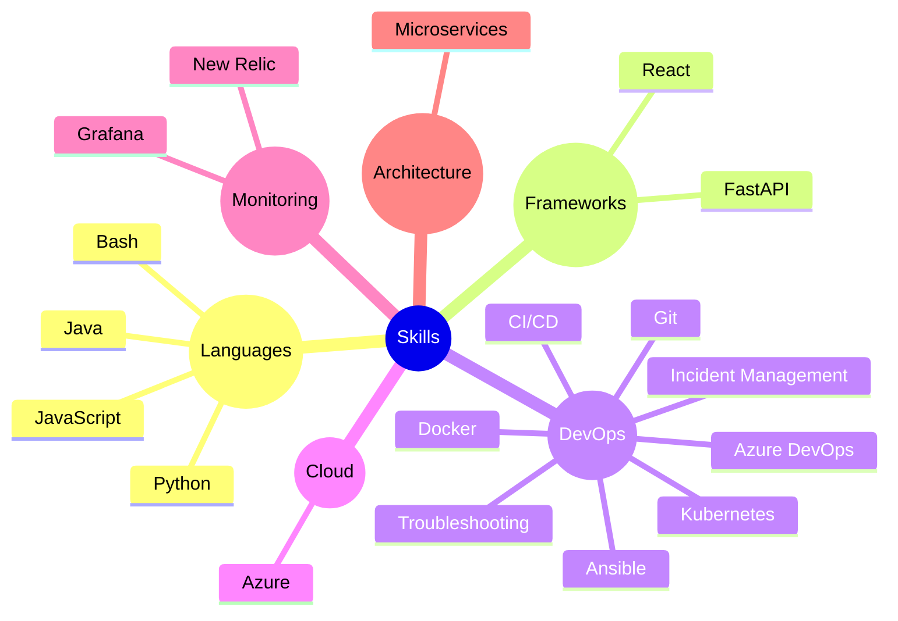

```java
public class Main {
    public static void main(String[] args) {
        System.out.println("Hello, World!");
    }
}

```

# 🖖 Eu sou a Jeni 

<p style="font-family: 'Courier New', Courier, monospace;">"Seja curioso. Leia bastante. Experimente coisas novas. Acredito que o que muitos chamam de inteligência é, na verdade, apenas curiosidade." — Aaron Swartz</p>

### 💼 Cargo Atual: Junior Site Reliability Engineer

### 📍 Localização: São Paulo, Brasil

### ⚡ Curiosidade: sou bailarina clássica e cosplayer

## 📫 Contatos:

[](https://www.linkedin.com/in/jenifer-dantas/) &nbsp;
[](mailto:jnfrdnts@gmail.com)

## 🛠️ Tecnologias e Ferramentas



## 🐍GitSnake<br>
  

